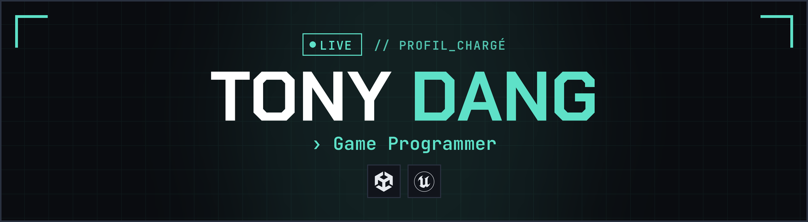

 

  

<!-- À REMPLACER : remplace TON-PSEUDO par ton pseudo itch.io -->

## `// À_PROPOS`

Étudiant en **3e année de Game Programming** à l'**IIM Digital School** (Nanterre).
Je conçois et programme des **systèmes de gameplay** et d'**UI** sous **Unity** et **Unreal Engine**, avec pour objectif des expériences fluides, lisibles et agréables à jouer.

- **Spécialités** : programmation gameplay · UI/UX
- **Recherche** : stage de **4 à 6 mois** en temps plein, à partir de **février 2027** (Île-de-France)

## `// STACK`

<table>
  <tr>
    <td><b>Moteurs</b></td>
    <td>
      
      &nbsp;Unreal : Blueprint &amp; C++
    </td>
  </tr>
  <tr>
    <td><b>Langages</b></td>
    <td></td>
  </tr>
  <tr>
    <td><b>Outils</b></td>
    <td>
      
      &nbsp;Trello · Mantis (suivi de bugs)
    </td>
  </tr>
</table>

## `// PROJETS`

| Projet | Contexte | Mon rôle | Liens |
| :-- | :-- | :-- | :-- |
| **Breaking Farm** | Tower defense · Unreal (Blueprint) Équipe de 7 · 2026 | Data · IA & pathfinding des monstres · système de vagues · looting |  |
| **Fallen Arcanes** | Puzzle mobile · Unity (C#) Équipe de 6 · 2026 | Adjacence des dominos · combos (UI) · deck & data · game state |   |
| **Scatboard** | Platformer · Unity (C#) Équipe de 4 · 2025 | Contrôles · caméra · collectibles · dialogues · UI · progression |  |

Tous mes projets en détail : **[tdang.vercel.app/work](https://tdang.vercel.app/work)**

## `// STATS_GITHUB`

  
  

<!-- OPTIONNEL : retire les deux blocs ci-dessous si ton activité publique est encore faible -->

  

  

**Une opportunité de stage ?** Écrivons-nous : [tony.dang@hotmail.fr](mailto:tony.dang@hotmail.fr) · [tdang.vercel.app](https://tdang.vercel.app)

