

 

  

&nbsp;&nbsp;
&nbsp;&nbsp;
&nbsp;&nbsp;
<a href="https://tonydng.itch.io">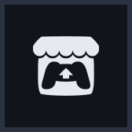</a>&nbsp;&nbsp;

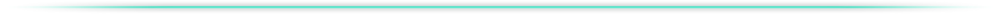

  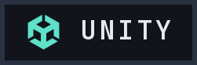&nbsp;
  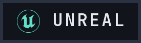&nbsp;
  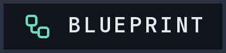&nbsp;
  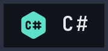&nbsp;
  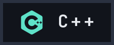&nbsp;
  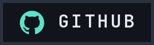&nbsp;
  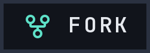&nbsp;
  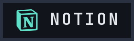&nbsp;
  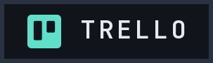

  

## // Featured_projects 

| Project | Context | My role | Links |
| :-- | :-- | :-- | :-- |
| **Breaking Farm** | Tower defense · Unreal (Blueprint) Team of 7 · 2026 | Data · Monster AI & pathfinding · wave system · looting |  |
| **Fallen Arcanes** | Mobile puzzle · Unity (C#) Team of 6 · 2026 | Domino adjacency · combos (UI) · deck & data · game state |   |
| **Scatboard** | Platformer · Unity (C#) Team of 4 · 2025 | Controls · camera · collectibles · dialogue · UI · progression |  |

All my projects in detail: **[tdang.vercel.app/work](https://tdang.vercel.app/work)**

## // Github_stats

  
  

  

  <picture>
    <source media="(prefers-color-scheme: dark)" srcset="./profile/snake.svg" />
    <source media="(prefers-color-scheme: light)" srcset="./profile/snake-light.svg" />
    
  </picture>

